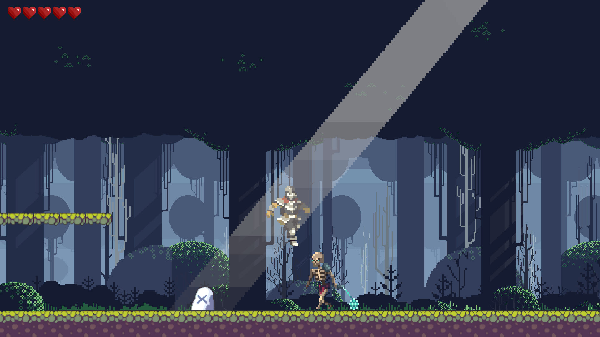
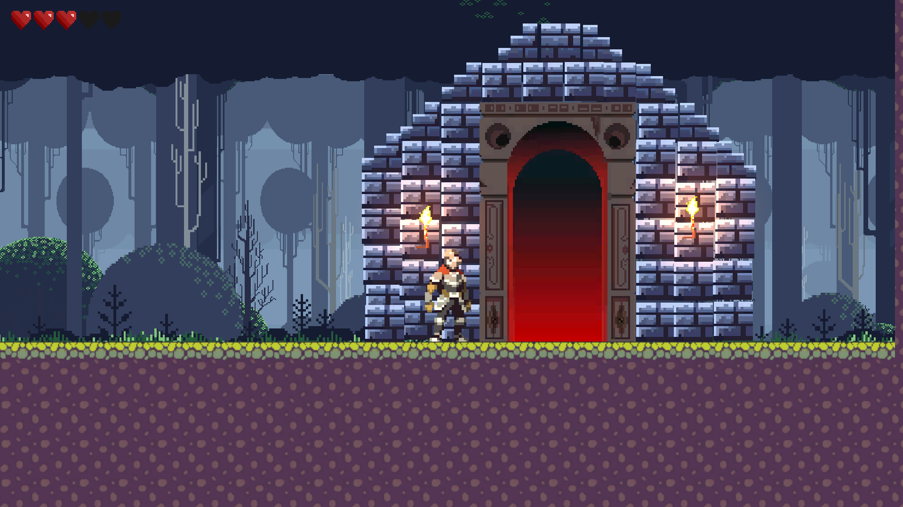
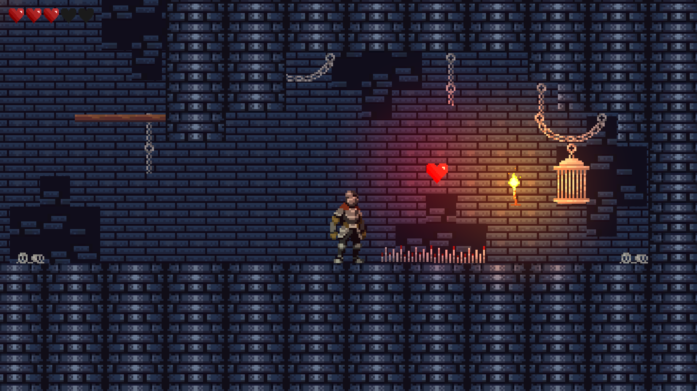
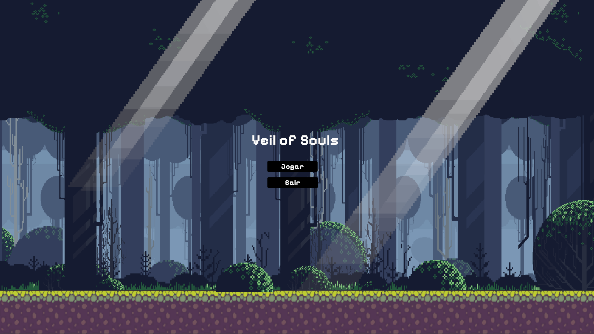

# 🎮 Veil of Soul

## 📖 Sobre o projeto

**Veil of Soul** é um jogo de plataforma 2D desenvolvido na Unity como parte de um projeto acadêmico da disciplina de Game Development.

O jogo combina exploração, combate e narrativa ambiental, onde o jogador assume o papel de um cavaleiro solitário em uma jornada para enfrentar Nekros, o Senhor do Véu, uma entidade responsável por corromper uma antiga floresta e aprisionar almas.

---

## 🧠 Mecânicas principais

- 🏃 Movimento lateral responsivo (andar e pular)
- ⚔ Sistema de combate corpo a corpo
- 🧱 Interação com plataformas e obstáculos
- 👾 Sistema de boss com padrões de ataque e fases
- 💀 Sistema de morte e reinício de estado
- 🎬 Cutscenes de introdução e final dinâmicas

---

## 🎯 Objetivo do jogo

Atravessar uma floresta corrompida e descer até as profundezas da dungeon para derrotar **Nekros**, restaurando a paz do reino e libertando as almas aprisionadas.

---

## 🎮 Controles

- **Setas** → Movimento lateral  
- **Z** → Pular  
- **X** → Ataque  
- **E** → Interação  
- **Space / Clique** → Avançar diálogos

---

## 🧩 Estrutura do jogo

- 🗺 3 fases com progressão de dificuldade  
- 👹 Boss final com IA e padrões de ataque  
- 🎬 Cutscenes de introdução e finalização  
- 🎯 HUD com vida do jogador e boss  
- 🔊 Sistema de áudio com efeitos e trilha sonora  

---

## 🛠️ Tecnologias utilizadas

- Unity Engine (2D)
- C#
- Animator Controller
- TextMeshPro
- Physics2D
- AudioSource / AudioClip

---

## 🎨 Arte e Assets

- O projeto utiliza assets gratuitos, utilizados exclusivamente para fins educacionais, respeitando suas respectivas licenças e diretrizes de uso.
- Efeitos sonoros para ataques, dano e interação
- Música ambiente para fases e boss fight
- Feedback sonoro para ações do jogador
- Agradecimentos a todos os artistas e desenvolvedores que disponibilizam seus recursos gratuitamente, contribuindo para o aprendizado e a evolução de novos desenvolvedores.

---

## ⚙️ Como executar o jogo

1. Baixe ou clone este repositório
2. Abra a pasta `veil-of-soul`
3. Execute o arquivo `Beaconkeeper.exe`
4. Jogue em tela cheia ou modo janela

---

## 📸 Screenshots

---

## 🚀 Possíveis melhorias futuras

- Novos bosses com padrões diferentes
- Sistema de upgrades do jogador
- Mais tipos de inimigos
- Expansão da narrativa
- Sistema de save/checkpoint

---

## 👨‍💻 Desenvolvimento

Projeto desenvolvido para a disciplina de Game Development.

Foco em:
- Lógica de programação em C#
- Design de níveis progressivo
- Experiência do jogador (UX)
- Implementação de cutscenes e narrativa

---

## 📌 Créditos

Desenvolvido por: **Vincyios Navarro**

Projeto acadêmico de Game Development